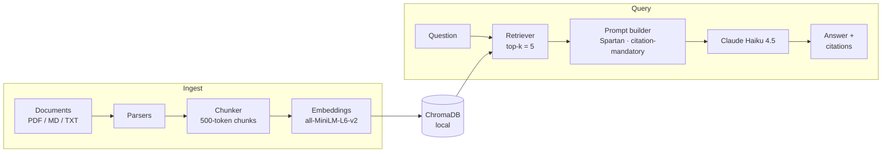

# docs-rag-assistant

Python CLI for ingesting documents and answering questions with Claude — every claim cited, every refusal honest.

[](https://www.python.org/) [](tests/) [](eval/README.md) [](LICENSE)

---

## Evaluation

Measured against a hand-curated 10-question golden set on 7 pages of the Anthropic API
documentation — 7 answerable questions and 3 anti-hallucination traps:

| Metric | Score | Threshold |
|--------|-------|-----------|
| Retrieval hit-rate | **100%** (7/7) | ≥ 80% |
| Answer accuracy | **100%** (7/7) | ≥ 80% |
| Anti-hallucination | **100%** (3/3) | 100% (hard fail) |

~$0.03 per full 10-question eval run at Claude Haiku 4.5 pricing. Reproducible by anyone
with an Anthropic API key:

```bash
uv run rag eval
```

**Retrieval hit-rate** counts how often the correct source document appears in the top-5
retrieved chunks *and* the expected fact substring is present — both conditions required.
A retrieval miss points to a chunking or embedding problem, not a prompt problem.

**Answer accuracy** measures whether Claude's final response contains the expected fact
without triggering the anti-hallucination fallback. Reported separately from retrieval so
prompt regressions are distinguishable from embedding regressions.

**Anti-hallucination** tests 3 questions with no answer in the corpus (e.g. "What is
Anthropic's stock ticker symbol?"). The system must output the exact fallback string —
no partial answers, no confident guesses. Any hallucination is a hard test failure.

---

## Demo


*Terminal recording of `rag ingest` → `rag ask` → `rag eval` coming in the next commit.*

---

## What it does

- Ingest PDF, Markdown, and plain text files into a local ChromaDB vector store
- Semantic search with sentence-transformers (`all-MiniLM-L6-v2`, 384-dim, runs locally)
- Answer questions via Claude Haiku 4.5 with mandatory inline citations on every claim
- Anti-hallucination: refuses to guess when the corpus doesn't contain the answer
- pytest-driven evaluation harness with explicit, code-tracked hit-rate thresholds

---

## Architecture



The ingest pipeline is cheap and local: documents are chunked at ~500 tokens with 50-token
overlap, embedded with sentence-transformers, and stored in a persistent ChromaDB collection.
The query pipeline embeds the question the same way, retrieves the top-5 nearest chunks, and
sends them to Claude with a strict system prompt.

The system prompt enforces two non-negotiable rules — mandatory inline citation (`[1]`, `[2]`,
...) on every factual sentence, and an exact fallback string when the retrieved chunks don't
contain the answer. Both rules are regression-tested in [`tests/test_prompts.py`](tests/test_prompts.py).

---

## Stack

| Layer | Technology |
|-------|-----------|
| Language | Python 3.11+ |
| Package manager | [uv](https://github.com/astral-sh/uv) |
| LLM | Claude Haiku 4.5 via Anthropic SDK |
| Embeddings | sentence-transformers `all-MiniLM-L6-v2` (local, 384-dim) |
| Vector store | ChromaDB (persistent, cosine similarity) |
| CLI | typer + rich |
| Testing | pytest (49 tests) |

---

## Install

```bash
git clone https://github.com/Abdullah-Duldul/docs-rag-assistant.git
cd docs-rag-assistant
uv sync
cp .env.example .env
# Add your ANTHROPIC_API_KEY to .env
```

Requires Python 3.11+. `uv sync` installs all dependencies and creates a virtual environment.
The embedding model (~80 MB) downloads automatically on first use.

---

## Usage

```bash
# Ingest documents from a folder (or a single file)
uv run rag ingest /path/to/docs

# Ask a question — retrieves top-5 chunks and generates a cited answer
uv run rag ask "What is the rate limit?"

# Show store status: chunk count, source files, DB path
uv run rag status

# Wipe the vector store (prompts for confirmation)
uv run rag reset

# Run the full evaluation harness
uv run rag eval
```

All commands accept `--db-path` to target a non-default ChromaDB location.
`rag eval` also accepts `--threshold` (default: 0.80) to override the pass threshold.

---

## Evaluation methodology

The golden set contains 10 questions written before running the eval ("good enough" defined
upfront, per the Monte Carlo validation discipline). Seven questions are answerable from the
corpus; three are deliberate traps — questions where the corpus contains no relevant
information. The anti-hallucination traps include questions like "What is Anthropic's stock
ticker symbol?" (Anthropic is private) and "What is the API endpoint for image generation?"
(Anthropic has no such API) to specifically test resistance to plausible training-data answers.

Retrieval and answer metrics are tracked as separate thresholds in code:

```python
# tests/test_eval.py
# TODO(step-7): raise to 0.80 after tuning chunk size / top-k / prompt
RETRIEVAL_HIT_RATE_THRESHOLD = 0.70
ANSWER_HIT_RATE_THRESHOLD    = 0.70
```

This makes threshold changes reviewable in code history and prevents silent regressions.

Full methodology: [eval/README.md](eval/README.md)

---

## Project structure

```
src/rag_assistant/
├── cli.py            # typer commands: ingest, ask, status, reset, eval
├── ingest.py         # document → chunks → embeddings → store
├── parsers.py        # PDF (pypdf), Markdown, plain text
├── chunker.py        # ~500-token chunks with 50-token overlap (tiktoken)
├── embeddings.py     # sentence-transformers lazy singleton
├── store.py          # ChromaDB wrapper: upsert, query, count, reset
├── retriever.py      # embed question → top-k semantic search
├── prompts.py        # RAG system prompt (Spartan tone, citation-mandatory)
├── generator.py      # Claude API call + AnswerResult assembly
└── eval_harness.py   # load golden set, evaluate retrieval + answer, report

eval/
├── corpus/           # 7 Anthropic API doc pages (.md, committed)
├── golden_questions.yaml  # 10 hand-curated Q&A pairs
└── README.md         # eval methodology

tests/                # 49 tests across all modules
```

---

## Tests

```bash
uv run pytest -v              # all 49 tests
uv run pytest -m "not slow"   # fast tests only (~4s, no model load)
uv run pytest -m eval         # eval harness (requires ANTHROPIC_API_KEY)
```

Test categories:
- **Fast** (38): unit tests for chunker, parsers, store, prompts, generator, CLI commands
- **Slow** (7): embedding shape, determinism, retrieval relevance, integration test
- **Eval** (4): golden set hit-rates with explicit threshold assertions

---

## Roadmap

- Hybrid retrieval (BM25 + dense vectors) to improve recall on keyword-heavy queries
- Streamlit UI for non-CLI users
- Multi-corpus support (separate named stores per project)

---

## License

MIT. See [LICENSE](LICENSE).

---

## Acknowledgments

Built as Project 2 of a 4-project Applied AI engineering portfolio.
